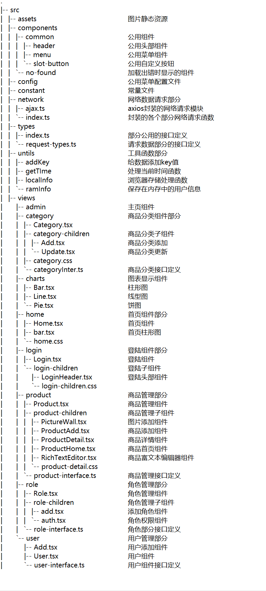

**测试后台管理系统，前端源码 [TS版本]。**

**项目说明**

本项目是基于typeScript + react-hooks搭建的一款后台管理系统demo。

**项目启动说明:**

1. 安装mongodb，并且启动mongodb服务。
2. 下载node后台代码。[**后台代码地址**](https://github.com/lmxyjy/admin_final)
3. 在下载后的后台代码根目录 `npm install` 安装依赖。
4. 在后台代码根目录 `npm start` 启动后台。
5. 下载本仓库前端代码
6. 在前端代码根目录`npm install` 安装所需依赖。
7. 在前端根目录`npm start`运行项目。 **

**项目技术选型:**

本次项目主要用到的技术是：

**主要编写语言：** TypeScript 。

**环境搭建:** React官方脚手架 create-react-app 。

**框架部分:** 选择了React新技术React-hooks。

**路由部分：** 选择了React-router。

**UI组件库:** 选择了Ant Design。

**数据请求:** 选择了axios 。

**项目图表部分:** 简单使用了echarts 。

**富文本编辑器部分:** 使用了react-draft-wysiwyg 。

**百度天气接口:** 使用了jsonp库做jsonp请求。

**项目开发过程中遇到的一些问题：**

[**项目练习记录：react-hooks中遇到的一些问题**](https://lmxyjy.github.io/react-hooks%E4%B8%AD%E7%9A%84%E4%B8%80%E4%BA%9B%E9%97%AE%E9%A2%98/)

**项目目录结构:**

**最后**

谢谢你能看到我的仓库,如果有任何意见或者建议欢迎与我联系。